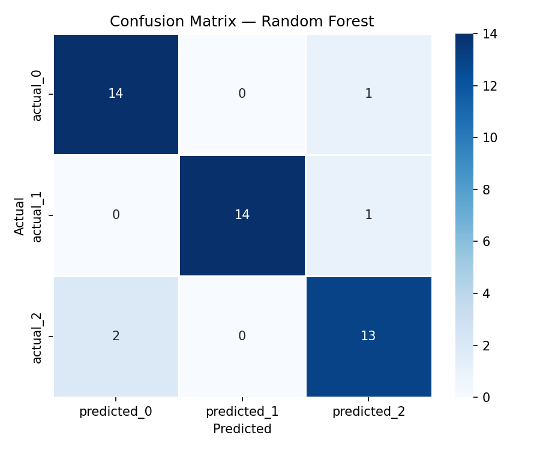
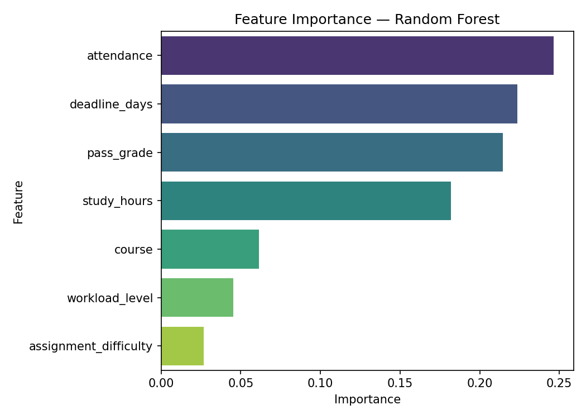

# Evaluation Report

## 1. Dataset Summary

The model is trained on `Data/cleaned_student_data.csv`.

| Item | Value |
|------|-------|
| Total rows | 300 |
| Features | 7: `course`, `study_hours`, `attendance`, `deadline_days`, `pass_grade`, `assignment_difficulty`, `workload_level` |
| Target | `risk_level` (LabelEncoder: see `Models/encoders.pkl`) |
| Missing values | None (all columns non-null) |
| Label noise | ~12% of rows randomly relabelled during generation to reduce deterministic leakage |

Column definitions: `Data/data_dictionary.md`.

Data is generated with overlapping feature ranges per risk class, probabilistic difficulty/workload, and injected label noise (`Source/data_generation.py`).

---

## 2. Train / Validation / Test Split

`sklearn.model_selection.train_test_split` with `random_state=42` and stratification.

| Split | Samples | Share |
|-------|---------|-------|
| Train | 210 | 70% |
| Validation | 45 | 15% |
| Test | 45 | 15% |

Model: `RandomForestClassifier(random_state=42)`.

The validation set is used only for an intermediate accuracy check during training. The test set is held out until final evaluation. Cross-validation runs only on the training set.

---

## 3. 5-Fold Cross-Validation

Cross-validation runs **only on the training set** (`X_train`, `y_train`).

| Fold | Accuracy |
|------|----------|
| Fold 1 | 0.9286 |
| Fold 2 | 0.7857 |
| Fold 3 | 0.8810 |
| Fold 4 | 0.8333 |
| Fold 5 | 0.9048 |
| **Mean** | **0.8667** |
| **Std** | **0.0513** |

Validation accuracy (held-out 15%): **0.8889** (88.89%).

Held-out test accuracy: **0.9111** (91.11%).

Test macro F1: **0.91**.

---

## 4. Confusion Matrix

CSV: `Outputs/confusion_matrix.csv`.

|  | pred_0 | pred_1 | pred_2 |
|--|--------|--------|--------|
| actual_0 | 14 | 0 | 1 |
| actual_1 | 0 | 14 | 1 |
| actual_2 | 2 | 0 | 13 |

---

## 5. Feature Importance

CSV: `Outputs/feature_importance.csv`.

Top features by importance: `attendance` (0.25), `deadline_days` (0.22), `pass_grade` (0.21), `study_hours` (0.18).

---

## 6. Inference API

`Source/model_utils.py` exposes:

- `load_model()` — loads `Models/study_risk_model.pkl` and `Models/encoders.pkl`
- `predict_for_user(...)` — encodes human-readable inputs and returns `risk_level`, `confidence`, and `probabilities`

The Streamlit **Risk Prediction** page (`Source/Frontend/pages_/risk_prediction.py`) calls these helpers and can persist results via `save_prediction()` in `db.py`.

---

## 7. Bug Fix — Feature Naming

During integration testing, predictions failed because the frontend sent `past_grade` while the model and dataset use `pass_grade`. **The frontend was corrected to use `pass_grade`** so inputs match the trained feature schema.

---

## 8. Limitations

- **Simulated data:** No real student records; patterns are approximations of academic behaviour.
- **Earlier leakage:** The first dataset version assigned `risk_level` by a fixed rule on the same features, which produced ~100% CV. The generator was updated with overlapping ranges, probabilistic categoricals, and ~12% label noise so metrics reflect learnable signal rather than a lookup table.
- **Sample size:** 300 rows is still small; confidence intervals would be wide on real data.
- **Course feature:** `course` has low importance; risk is driven mainly by hours, attendance, deadlines, and grades.

---

## 9. Q&A — “Why isn’t accuracy 100% anymore?”

> Our first dataset was synthetic and rule-based, so labels were almost a deterministic function of the features — that is why early cross-validation hit 100%. We treated that as a red flag, not a result. We rebuilt the generator with **overlapping value ranges, probabilistic difficulty/workload, and ~12% label noise**, and we evaluate on a **held-out validation and test split** the model never sees during cross-validation. Accuracy is now about **87% CV mean** and **91% on the test set**, which is realistic for this signal. The pipeline — Random Forest, 5-fold CV, confusion matrix, feature importance — is built to plug into real student data; the main limitation today is the data source, not the method.
