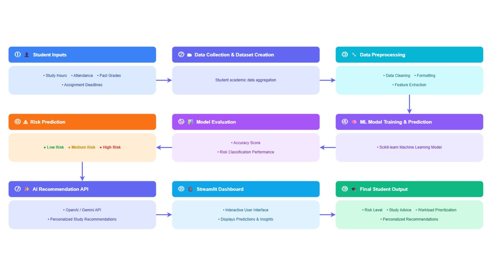

# AI Smart Study Risk & Performance Predictor

## Project Overview

AI Smart Study Risk & Performance Predictor is a prototype system designed to help students identify potential academic risks before they become serious problems. The system analyzes factors such as study hours, attendance, deadlines, grades, assignment difficulty, and workload level to predict whether a student has a Low, Medium, or High academic risk level.

The project combines data preprocessing, machine learning, and an interactive Streamlit dashboard to provide risk predictions and study recommendations.

---

## Team Members

| Team Member          | Role                            |
| -------------------- | ------------------------------- |
| Eylül Özekinci       | Machine Learning Model          |
| Azra Özdaş           | Frontend / Streamlit Dashboard  |
| Müslüm Selim Akşahin | Data Collection & Preprocessing |
| Dilay Tarhan         | Testing & Documentation         |

---

## System Workflow



Student Input → Dataset → Preprocessing → Machine Learning Model → Risk Prediction → Study Recommendation → Dashboard

---

## Technologies Used

* Python
* Pandas
* NumPy
* Scikit-learn
* Streamlit
* Joblib
* GitHub
* Microsoft Teams

---

## Repository Structure

```text
Data/
├── student_study_data.csv
├── cleaned_student_data.csv

Source/
├── preprocessing.py
├── ml_model.py
└── Frontend/
    └── app.py

Models/
└── study_risk_model.pkl

Outputs/
└── predictions.csv

Documentation/
├── workflow_diagram.png
├── system_design.md
├── problem_analysis.md
└── testing_report.md

Logs/
└── daily_logs.md
```

---

## Installation

Clone the repository:

```bash
git clone <repository-url>
cd AI_SE04_StudyRiskPredictor
```

Create a virtual environment:

```bash
python -m venv .venv
```

Activate the virtual environment:

### Windows

```bash
.venv\Scripts\activate
```

### macOS / Linux

```bash
source .venv/bin/activate
```

Install dependencies:

```bash
pip install -r requirements.txt
```

---

## Running the Project

### Step 1 — Data Preprocessing

```bash
python Source/preprocessing.py
```

### Step 2 — Train the Machine Learning Model

```bash
python Source/ml_model.py
```

### Step 3 — Launch the Dashboard

```bash
streamlit run Source/Frontend/app.py
```

---

## Dashboard Features

* Academic risk prediction
* Study recommendations
* Dataset preview
* Model output visualization
* Team information page
* Interactive user interface

---

## Model Performance

**Random Forest Classifier — 210-row simulated dataset**

| Metric | Value |
| --- | --- |
| Test Accuracy | 97.6% |
| 5-Fold CV Mean Accuracy | 98.6% |
| 5-Fold CV Std Deviation | ±2.9% |
| Macro Avg F1 Score | 0.98 |

> Note: High accuracy reflects the structured nature of the simulated dataset.
> Real-world performance would require validation with actual student data.

---

## Screenshots

<!-- Screenshots will be added on June 1 -->

---

## Future Improvements

* Larger academic datasets
* More advanced machine learning models
* Personalized AI recommendations
* PDF and document analysis
* Real-time notifications and reminders
* Cloud deployment support

---

## License

This project is released under the MIT License. See the LICENSE file for details.
