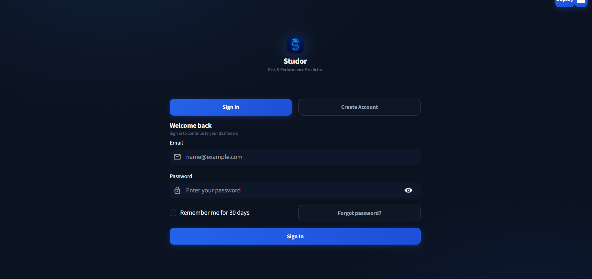
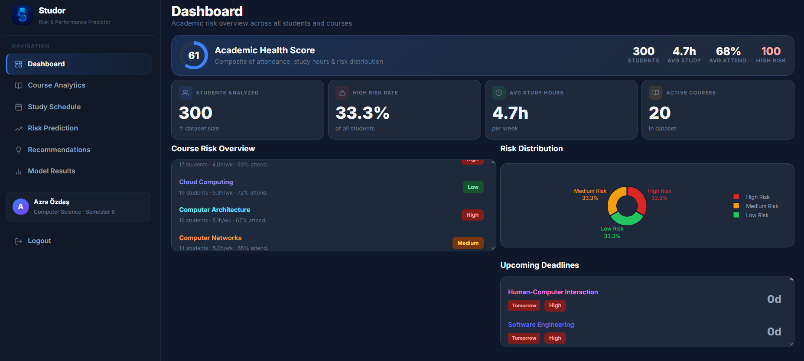
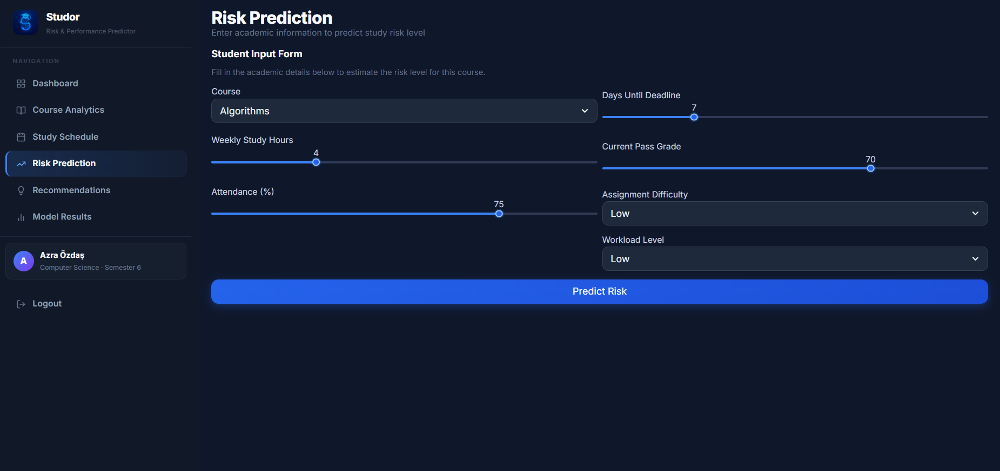
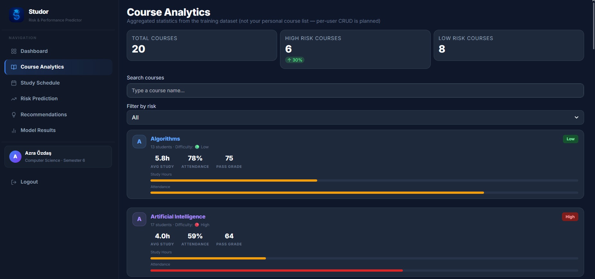
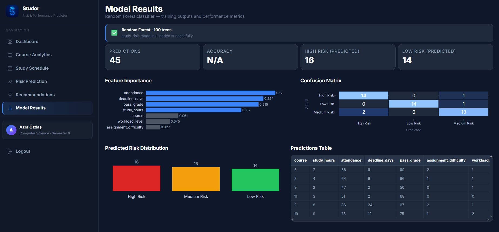

# AI Smart Study Risk & Performance Predictor (Studor)

## Project Overview

**Studor** (AI Smart Study Risk & Performance Predictor) is a prototype system that helps students identify potential academic risks before they become serious problems. The system analyzes study hours, attendance, deadlines, pass grades, assignment difficulty, and workload level to predict whether a student has a **Low**, **Medium**, or **High** academic risk level.

The project combines data preprocessing, machine learning, and an interactive Streamlit dashboard for risk prediction and study recommendations.

---

## Team Members

| Team Member          | Role                            |
| -------------------- | ------------------------------- |
| Eylül Özekinci       | Machine Learning Model          |
| Azra Özdaş           | Frontend / Streamlit Dashboard  |
| Müslüm Selim Akşahin | Data Collection & Preprocessing |
| Dilay Tarhan         | Testing & Documentation         |

---

## System Workflow


Student Input → Dataset → Preprocessing → Machine Learning Model → Risk Prediction → Study Recommendation → Dashboard

---

## Daily Progress Logs

Recent work is recorded in [`Logs/daily_logs.md`](Logs/daily_logs.md).  
Progress updates are also shared with the team on **Microsoft Teams** during the project timeline.

---

## Technologies Used

* Python
* Pandas
* NumPy
* Scikit-learn
* Streamlit
* Plotly
* Joblib
* PostgreSQL (Supabase — hosted, shared database)
* GitHub
* Microsoft Teams

---

## Repository Structure

```text
Data/
├── student_study_data.csv
├── cleaned_student_data.csv
└── data_dictionary.md

Source/
├── preprocessing.py
├── ml_model.py
├── model_utils.py
├── data_generation.py
├── Backend/
│   └── db.py
└── Frontend/
    ├── app.py              # main router + custom sidebar
    ├── bootstrap.py
    ├── login.py
    ├── pages_/             # feature pages (imported by app.py)
    │   ├── dashboard.py
    │   ├── dataset_course_stats.py   # Course Analytics
    │   ├── risk_prediction.py
    │   ├── study_schedule.py
    │   ├── recommendations.py
    │   ├── model_results.py
    │   └── profile.py
    ├── styles.py
    ├── utils.py
    └── assets/
        └── logo.png

Models/
├── study_risk_model.pkl
└── encoders.pkl

Outputs/
├── metrics.json
├── predictions.csv
├── confusion_matrix.csv
├── confusion_matrix.png
├── feature_importance.csv
└── feature_importance.png

Documentation/
├── demo_script.md
├── deployment_plan.md
├── gantt_chart.md
├── workflow_diagram.png
├── system_design.md
├── problem_analysis.md
├── progress_report.md
├── testing_report.md
├── evaluation_report.md
├── performance_check.md
├── team_contributions.md
└── Screenshots/

Logs/
└── daily_logs.md

Reports/
└── final_audit_summary.md
```

---

## Installation

Clone the repository:

```bash
git clone <repository-url>
cd AI_SE04_StudyRiskPredictor
```

Create a virtual environment:

```bash
python -m venv .venv
```

Activate the virtual environment:

### Windows

```bash
.venv\Scripts\activate
```

### macOS / Linux

```bash
source .venv/bin/activate
```

Install dependencies:

```bash
pip install -r requirements.txt
```

Configure environment:

```bash
cp .env.example .env   # Windows: copy .env.example .env
```

Edit `.env` and set `DATABASE_URL` from your Supabase project settings.

---

## First-Run Setup

The trained model (`Models/study_risk_model.pkl`), encoders (`Models/encoders.pkl`), and ML outputs in `Outputs/` are **included** so inference works without retraining.

**Database credentials are not in the repo.** Copy `.env.example` to `.env` and set `DATABASE_URL`. Login and saved predictions require internet access to Supabase.

Retrain only if you change the dataset:

### Step 1 — Data Preprocessing

```bash
python Source/preprocessing.py
```

### Step 2 — Train the Machine Learning Model

```bash
python Source/ml_model.py
```

### Step 3 — Launch the Dashboard

```bash
streamlit run Source/Frontend/app.py
```

Register a new account on the login screen.

---

## Dashboard Features

| Page | Description |
|------|-------------|
| **Dashboard** | Dataset-backed academic overview (KPIs, risk distribution, deadlines) |
| **Course Analytics** | Aggregated statistics from the training CSV (read-only) |
| **Risk Prediction** | ML risk classification with confidence and recommendations |
| **Study Schedule** | Rule-based weekly plan from dataset risk patterns |
| **Recommendations** | Study tips linked to your latest prediction |
| **Model Results** | Confusion matrix, feature importance, test predictions |
| **Profile** | Account settings and project team info |

Authentication uses Supabase PostgreSQL (register, sign in, password reset via security question).

**Live demo:** [Documentation/demo_script.md](Documentation/demo_script.md)

---

## Model Performance

**Random Forest Classifier — 300-row simulated dataset (~12% label noise)**

| Metric | Value |
| --- | --- |
| Test Accuracy | 91.11% |
| Validation Accuracy | 88.89% |
| 5-Fold CV Mean Accuracy | 86.67% |
| 5-Fold CV Std Deviation | 0.0513 |
| Macro Avg F1 Score | 0.91 |

Split: **70% train / 15% validation / 15% test** (stratified). Cross-validation runs on the training set only.

Authoritative metrics: `Outputs/metrics.json` and [Documentation/evaluation_report.md](Documentation/evaluation_report.md).

---

## Screenshots

Application screenshots are stored under `Documentation/Screenshots/`:







---

## Future Improvements

* Larger and real-world academic datasets
* Hyperparameter tuning and additional ML models
* Display saved prediction history on the Profile page
* Per-user course management (database schema reserved)
* Cloud deployment on Streamlit Community Cloud

---

## License

This project is released under the MIT License. See the `LICENSE` file for details.
